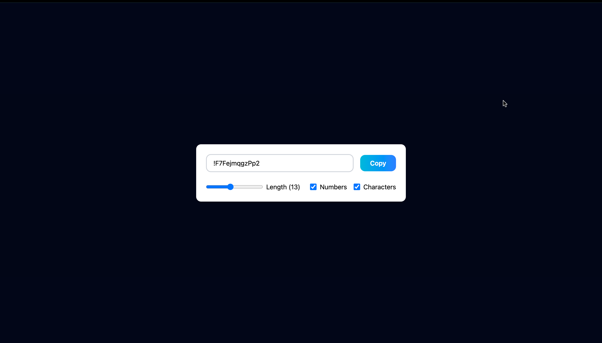

# 📌 Password Generator using React JS

**Short Description:** This generates the strong password which inclues uppercase, lowercase, number and Speical Charaters and can copy it with single button of the click. It's fully responsive for all the devices, tablets, laptops and bigger devices.  

## 🚀 Features
- ✅ Generates the Password based on the length Input, Numbers Checked and Characters Checked.
- ✅ Can copy with the copy button.
- ✅ Custome copy Success/failed  alert.

## 📸 Preview (Optional)


## 🛠️ Tech Stack
- **Frontend:** HTML, TailwindCSS, JavaScript, ReactJS

## 📂 Installation & Setup
1. Clone the repository:
   ```bash
   git clone https://github.com/asius09/Password-Generator-ReactJS.git
   ```
2. Navigate to the project folder:
   ```bash
   cd Password-Generator-ReactJS
   ```
3. Install dependencies:
   ```bash
   npm install
   ```
4. Run the project:
   ```bash
   npm run dev
   ```

## 📖 Usage
Just select the length, if you like numbers and charaters which is options check it and your password has been genrated, click the copy button. Now all done you have a strong password.


## 💡 Lessons Learned
In this Project, I use hooks specifically useEffect to controle the useCallback which renders the change only when the dependencies changes same with useEffect but there are some more use case but this is the one I use. I also implemented useState() very clearly and tailwindcss with the react which taught me how to make custom alert and make the page responsive.

## 🙌 Contributing
If you'd like to contribute, feel free to fork the repo and create a pull request.

## 📄 License
This project is licensed under the **MIT License**.
